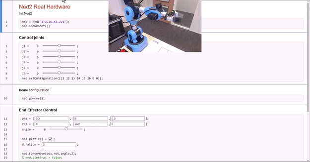
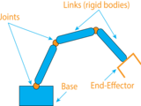
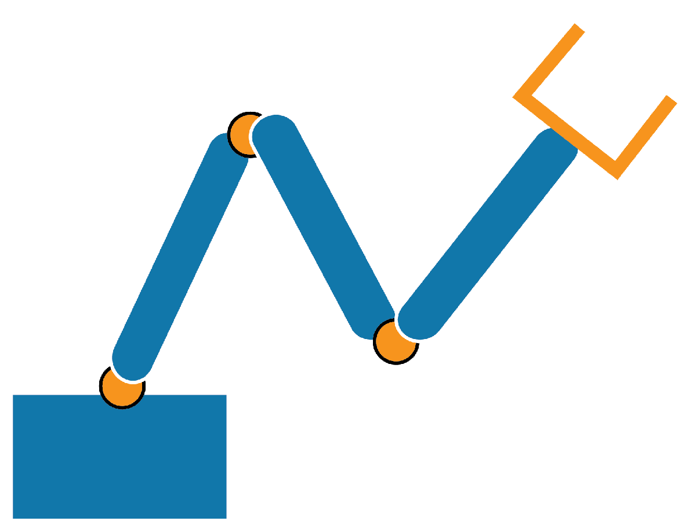
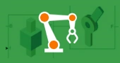
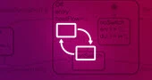

# MATLAB Support for Niryo Ned2 Robots

With the Robotics System Toolbox and ROS Toolbox, you can easily connect to and control Niryo Ned2 Robots, leveraging MATLAB's advanced capabilities in robotics and automation.

This repository requires [MATLAB](https://www.mathworks.com/products/matlab.html)® R2024b or later, [Robotics System Toolbox](https://www.mathworks.com/products/robotics.html) and [ROS Toolbox](https://www.mathworks.com/products/ros.html).

## Why Use Niryo Ned2 Robots with MATLAB?
-   **Interactive Learning:** Experiment with real\-world robotics applications, bridging the gap between theory and practice. Simulate, control, and visualize robot operations all in one place. 
-   **Project\-based exploration:** Create projects that challenge creativity and problem\-solving skills, from basic control tasks to advanced AI\-driven robotics. 
-  **Comprehensive Curriculum:** Leverage MathWorks' extensive educational resources to design courses that cover fundamental to advanced robotics concepts. Use real\-time data and simulations to make abstract concepts tangible. 
# Getting started

To get started, install and look at *FirstSetup.mlx* for more information on using the toolbox.

| **File**    | **Description**     |
| :-- | :-- |
| Ned2\_Simulation.mlx    | Control a simulated model of Niryo Ned2.     |
|  |      |
| Ned2\_Hardware.mlx    | Control a real Niryo Ned2 robot (requires ROS Toolbox)     |
|  |      |

## Core Functions
| **Function**    | **Description**     |
| :-- | :-- |
| SetPose()    | Control robot joint angles.     |
| PlanTrajectory()    | Plan a trajectory that follows multiple waypoints     |
| Move()    | Use Inverse Kinematics to find a joint configuration for a given XYZ position     |

## Features to Explore
-  [**Stateflow**](https://www.mathworks.com/help/stateflow/getting-started.html): Develop complex logic and state machines for advanced control systems, making your robot smarter and more autonomous. 
-  [**Motion and Path Planning**](https://www.mathworks.com/help/robotics/motion-and-path-planning.html): Experiment with different path planning algorithms to optimize robot movements with collision avoidance, enhancing efficiency and performance. 
-  [**Image Processing**](https://www.mathworks.com/help/images/index.html) **and** [**Computer Vision**](https://www.mathworks.com/help/vision/recognition-object-detection-and-semantic-segmentation.html): Integrate sensors and use MATLAB's image processing capabilities to add perception to your robot, enabling it to interact with its environment intelligently. 

# Related Courseware Modules
### 

  <table>
    <tr>
      <td colspan="2" style="text-align:center;">
        <a href="https://www.mathworks.com/matlabcentral/fileexchange/130124-robotic-manipulators">Robotic Manipulators</a>
      </td>
      <td colspan="2" style="text-align:center;">
        <a href="https://www.mathworks.com/matlabcentral/fileexchange/136364-applied-linear-algebra">Applied Linear Algebra: Robotics</a>
      </td>
    </tr>
    <tr>
      <td style="text-align:center;">
         
      </td>
      <td>
        Available on: 
         
         
        <a href="https://github.com/MathWorks-Teaching-Resources/Robotic-Manipulators">GitHub</a> 
      </td>
      <td style="text-align:center;">
         
      </td>
      <td>
        Available on: 
         
         
        <a href="https://github.com/MathWorks-Teaching-Resources/Applied-Linear-Algebra">GitHub</a> 
      </td>
    </tr>
  </table>

Explore our other [<u>modular courseware content</u>](https://www.mathworks.com/matlabcentral/fileexchange/?q=tag%3A%22courseware+module%22&sort=downloads_desc_30d).

# Self\-Paced Online Courses
| [**Multibody Simulation Onramp**](https://matlabacademy.mathworks.com/details/multibody-simulation-onramp/ormb)    | [**MATLAB Onramp**](https://matlabacademy.mathworks.com/details/matlab-onramp/gettingstarted)    | [**Stateflow Onramp**](https://matlabacademy.mathworks.com/details/stateflow-onramp/stateflow)     |
| :-: | :-: | :--: |
|     |     |      |

# License
The license is available in the <samp>license.txt</samp> file within this repository.

# Contribute
Looking for more? Find an issue? Have a suggestion? Please contact the [<u>MathWorks teaching resources team</u>](mailto:%20onlineteaching@mathworks.com). If you want to contribute directly to this project, you can find information about how to do so in the [<u>CONTRIBUTING.md</u>](./CONTRIBUTING.md) page on GitHub.

Copyright 2024-2025 The MathWorks, Inc.